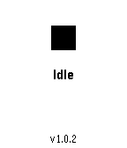
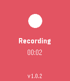
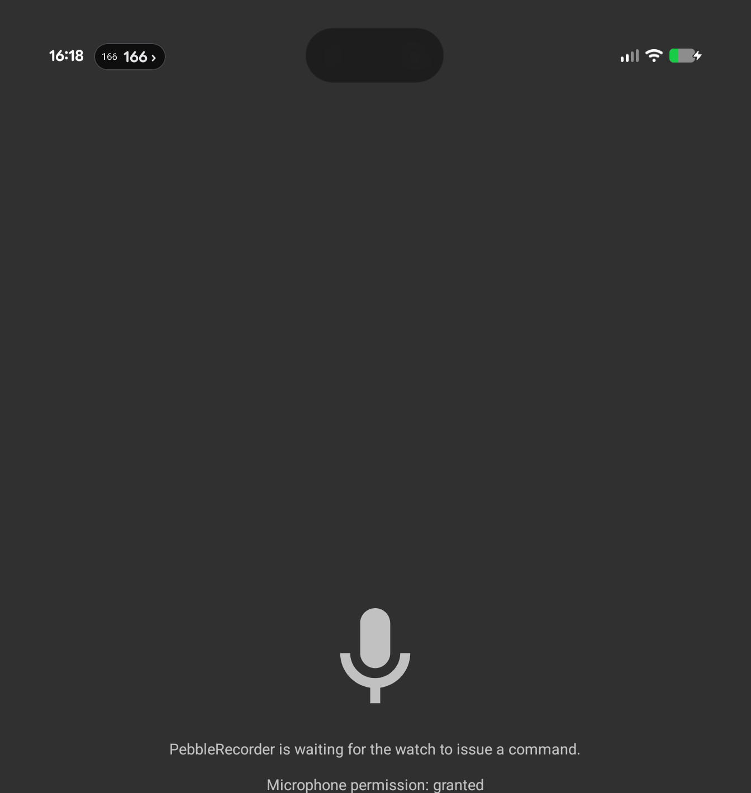

# PebbleRecorder

Turn your Pebble watch into a remote start/stop trigger for audio recording on your phone. Press
a button on the watch, and a companion Android app records straight to a folder you choose — no
need to touch your phone.

## How it works

Two apps, working together:

- **`watch/`** — a Pebble watchapp (C) with an Idle → Starting → Recording → Stopping state
  machine. It has no microphone logic of its own; it just sends a start/stop command and displays
  whatever status comes back, with a mic/record/stop icon and a live elapsed-time timer.
- **`android/`** — a native Android app (Kotlin) that does the actual recording via
  `MediaRecorder`, writing AAC/M4A files into a folder you pick.

They don't talk directly over Bluetooth. The watch and phone communicate over Pebble's
`AppMessage` protocol, relayed through the Pebble/Core companion app (e.g. Core Devices' official
app) via `PebbleKit Android 2`:

```
watch app  <--AppMessage-->  Pebble/Core companion app  <--AIDL-->  android/ app
           (real BLE link)
```

### Why doesn't the watch just record audio?

Pebble's SDK has never exposed raw mic/PCM access to third-party watchapps — the only public mic
API is the cloud-based Dictation API (speech → text, not audio). So all recording logic lives on
the phone; the watch is just a button.

## Screenshots

<p>
  
  
  
</p>

## Status

Working end-to-end, verified on real hardware (a Pebble Time 2 and a Pixel phone): pressing the
watch button starts a recording, the phone captures real AAC/M4A audio into your chosen folder,
and pressing again stops it — cleanly, with the watch showing a live elapsed-time timer throughout.

## Getting started

### Watch app

Requires the [Pebble SDK](https://developer.repebble.com) (`pebble-tool`).

```sh
cd watch
pebble build                          # builds all target platforms
pebble install --emulator basalt      # install + run in the QEMU emulator
pebble install --phone <phone-ip>     # install to a real watch via a paired phone
                                       # (needs "Use LAN developer connection" enabled in the
                                       # companion app's connectivity settings)
```

### Android app

```sh
cd android
./gradlew :app:assembleGithubDebug
```

Install the APK and grant it microphone access when prompted. Recordings go to
`Downloads/PebbleRecorder` by default - pick a different folder in the app if you'd rather use
one of your own. From then on it runs quietly in the background, armed for the watch trigger.

## Requirements

- A Pebble watch (Time/Steel/Round, Pebble 2, or Core Time 2) with a phone running a
  PebbleKit-2-compatible companion app (e.g. [Core Devices' companion
  app](https://github.com/coredevices/mobileapp)).
- An Android phone running Android 8.0 (API 26) or newer.

## Project layout

```
watch/    Pebble watchapp (C) - the remote trigger
android/  Android app (Kotlin) - does the actual recording
```

See each directory's own docs for more detail on its build setup.

## Changelog

See the [Releases page](https://github.com/BigWebstas/PebbleRecorder/releases) for downloadable `.apk`/`.pbw` artifacts of each version.

### [v0.1.16](https://github.com/BigWebstas/PebbleRecorder/releases/tag/v0.1.16)
- The main screen now shows whether the app is exempt from Android's background battery restrictions (Doze), with a one-tap button to allow unrestricted battery use — the watch trigger needs this to stay alive in the background.

### [v0.1.15](https://github.com/BigWebstas/PebbleRecorder/releases/tag/v0.1.15)
- Watch app (`1.0.3`): on touch watches like the Pebble Time 2, tapping the screen now starts a recording and toggles it between recording and paused. Stop stays on the SELECT button.

### [v0.1.14](https://github.com/BigWebstas/PebbleRecorder/releases/tag/v0.1.14)
- When a transcription fails after its retries, the app now posts a silent notification with the error; tapping it opens the app and shows the full error in a dialog.

### [v0.1.13](https://github.com/BigWebstas/PebbleRecorder/releases/tag/v0.1.13)
- When transcription is on, a recording now stays hidden until its Gemini transcript is ready, so the audio and the `-txt.md` transcript appear together instead of seconds apart.
- Transcription now retries transient failures (network errors, rate limits, server errors) a few times before giving up; the recording is always kept even if transcription ultimately fails.

### [v0.1.12](https://github.com/BigWebstas/PebbleRecorder/releases/tag/v0.1.12)
- Moved the Fastlane metadata to the repository root so F-Droid's release server picks up the app description, screenshots and changelogs (its released tooling doesn't scan nested paths). No app behavior changes.

### [v0.1.11](https://github.com/BigWebstas/PebbleRecorder/releases/tag/v0.1.11)
- Fixed F-Droid reproducible build: disabled the AGP "Dependency metadata" signing block (Play Console-only, unused here) that F-Droid's binary scanner rejected. No app behavior changes.

### [v0.1.10](https://github.com/BigWebstas/PebbleRecorder/releases/tag/v0.1.10)
- Fixed F-Droid build: added a lock file for `watch/package.json` so F-Droid's dependency scanner stops rejecting the build. No app behavior changes.

### [v0.1.9](https://github.com/BigWebstas/PebbleRecorder/releases/tag/v0.1.9)
- Prepared for F-Droid: added an `fdroid` build flavor that ships without the bundled Pebble watchapp binary (which F-Droid's build server can't reproduce from source), hiding the in-app "Install the app on Pebble" sideload button in that build only.

### [v0.1.8](https://github.com/BigWebstas/PebbleRecorder/releases/tag/v0.1.8)
- Gemini transcripts now identify distinct speakers and label each line with a consistent speaker tag (**Speaker 1:**, **Speaker 2:**, etc.) formatted as markdown, instead of one undifferentiated block of text.

### [v0.1.7](https://github.com/BigWebstas/PebbleRecorder/releases/tag/v0.1.7)
- The app now re-arms itself after a phone reboot and posts a notification prompting a single tap to fully re-enable the watch trigger, instead of requiring you to dig into the app to find it.

### [v0.1.6](https://github.com/BigWebstas/PebbleRecorder/releases/tag/v0.1.6)
- Fixed the location tag sometimes being missing from Gemini transcripts - the app now also requests a fresh GPS/network fix in the background instead of relying only on a cached last-known location.
- Fixed Gemini sometimes returning an empty transcript on short recordings.
- A chosen recording folder no longer silently reappears after an uninstall/reinstall (it's now excluded from Android backup, matching the Gemini API key).

### [v0.1.5](https://github.com/BigWebstas/PebbleRecorder/releases/tag/v0.1.5)
- Recordings default to the public `Downloads/PebbleRecorder` folder automatically until you pick a different one - no setup required before the first recording.
- Recording and transcript file names now end in `-rec.m4a` / `-txt.md` instead of sharing a bare timestamp, so the two are easy to tell apart in a file listing.
- Renamed the watchapp sideload button to "Install the app on Pebble".
- Fixed a leftover-file bug when the watch triggers recording before the app has ever been opened.
- Fixed Gemini transcripts sometimes coming back empty.

### [v0.1.4](https://github.com/BigWebstas/PebbleRecorder/releases/tag/v0.1.4)
- Optional location tagging in Gemini transcripts: a `location`/`maps` header line plus a reverse-geocoded `#AddressAsOneWord` hashtag.
- Live "Status: Idle / Recording / Paused" indicator on the Android main screen.
- Location permission status shown alongside the microphone permission line.
- "Install watchapp on watch" button - hands the bundled `.pbw` to the Pebble/Core companion app directly.

### [v0.1.3](https://github.com/BigWebstas/PebbleRecorder/releases/tag/v0.1.3)
- Pause/resume from the watch (UP or DOWN), with a red/blue background on color watches and a timer that pauses and resumes rather than resetting.
- Optional Gemini transcription: finished recordings are transcribed and saved as a same-named `.md` file.
- Tapping the persistent notification now reopens the app.

### [v0.1.2](https://github.com/BigWebstas/PebbleRecorder/releases/tag/v0.1.2)
- Large mic icon on the Android main screen, matching the notification icon.
- App version shown on both the Android main screen and the watch footer.

### [v0.1.1](https://github.com/BigWebstas/PebbleRecorder/releases/tag/v0.1.1)
- Shortened the status text on the Android main screen.

### [v0.1.0](https://github.com/BigWebstas/PebbleRecorder/releases/tag/v0.1.0)
- First working end-to-end release: watch button press → recording → AAC/M4A file in your chosen folder.
- Idle/Recording state machine on the watch with a status icon and live elapsed-time timer.
